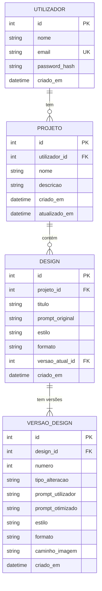

# Modelo de Dados (Diagrama ER)

## Diagrama

## Entidades

### Utilizador
Conta de quem usa a aplicação.

| Atributo | Tipo | Notas |
|---|---|---|
| id | INTEGER | PK, autoincremento |
| nome | TEXT | obrigatório |
| email | TEXT | obrigatório, único |
| password_hash | TEXT | nunca guardar a password em texto |
| criado_em | DATETIME | default: agora |

### Projeto
Agrupa designs de um utilizador (ex.: "Campanha Natal").

| Atributo | Tipo | Notas |
|---|---|---|
| id | INTEGER | PK |
| utilizador_id | INTEGER | FK → Utilizador.id, `ON DELETE CASCADE` |
| nome | TEXT | obrigatório |
| descricao | TEXT | opcional |
| criado_em | DATETIME | |
| atualizado_em | DATETIME | atualizado sempre que um design muda |

### Design
Um design gerado a partir de um prompt. Guarda o pedido original (usado em **regenerar**) e o estado atual.

| Atributo | Tipo | Notas |
|---|---|---|
| id | INTEGER | PK |
| projeto_id | INTEGER | FK → Projeto.id, `ON DELETE CASCADE` |
| titulo | TEXT | gerado pelo LLM ou pelo utilizador |
| prompt_original | TEXT | primeiro pedido do utilizador |
| estilo | TEXT | estilo atual (minimalista, retro, corporate...) |
| formato | TEXT | formato atual (instagram_post, story, banner, a4, youtube_thumb) |
| versao_atual_id | INTEGER | FK → VersaoDesign.id, nullable |
| criado_em | DATETIME | |

### VersaoDesign
Cada alteração cria uma nova versão, o que dá o **histórico de versões** sem perder as anteriores.

| Atributo | Tipo | Notas |
|---|---|---|
| id | INTEGER | PK |
| design_id | INTEGER | FK → Design.id, `ON DELETE CASCADE` |
| numero | INTEGER | 1, 2, 3... (único por design) |
| tipo_alteracao | TEXT | `criacao`, `edicao`, `estilo`, `formato`, `regeneracao` |
| prompt_utilizador | TEXT | o que o utilizador escreveu nesta versão |
| prompt_otimizado | TEXT | prompt gerado pelo LLM e enviado à API de imagem |
| estilo | TEXT | estilo usado nesta versão |
| formato | TEXT | formato usado nesta versão |
| caminho_imagem | TEXT | caminho/URL da imagem gerada |
| criado_em | DATETIME | |

## Relações

- **Utilizador 1 : N Projeto**: um utilizador tem vários projetos; cada projeto pertence a um utilizador.
- **Projeto 1 : N Design**: um projeto contém vários designs.
- **Design 1 : N VersaoDesign**: um design tem pelo menos uma versão (a de criação).

## Como as funcionalidades usam o modelo

| Funcionalidade | Efeito na BD |
|---|---|
| Gerar design | cria `Design` + `VersaoDesign` nº1 (`criacao`) |
| Personalizar por prompt | nova `VersaoDesign` (`edicao`) |
| Alterar estilo | nova `VersaoDesign` (`estilo`), atualiza `Design.estilo` |
| Alterar formato | nova `VersaoDesign` (`formato`), atualiza `Design.formato` |
| Regenerar | nova `VersaoDesign` (`regeneracao`) a partir de `prompt_original` |
| Gestão de projetos | CRUD em `Projeto`; apagar em cascata designs e versões |

Em todas as alterações, `Design.versao_atual_id` passa a apontar para a nova versão.
